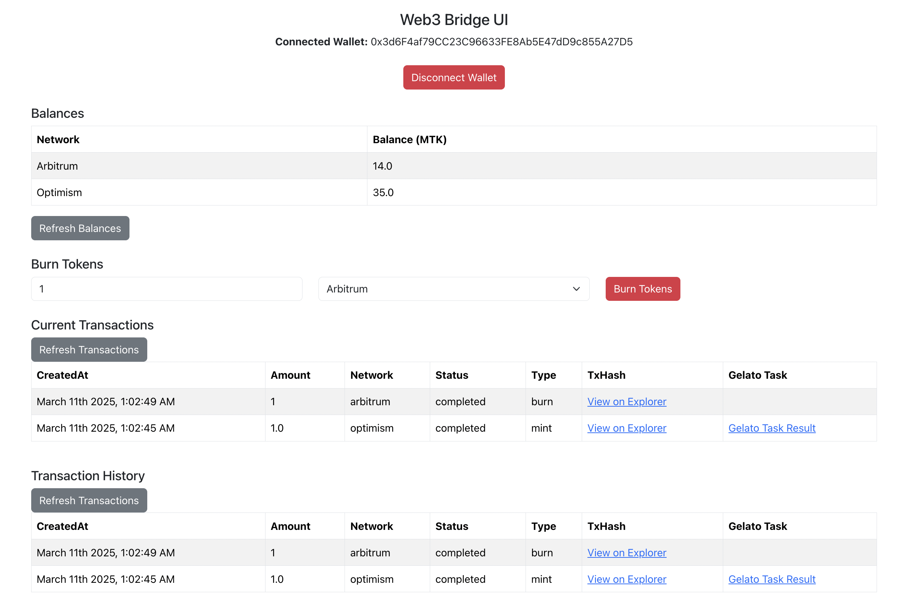

# Gelato Web UI

## Purpose

This ui is in Next.js, and it is for users to login via their wallet.
And, users can try burn their tokens in one test network to other.

## Operations Supported

- Connect your wallet through metamask
- Check balance on both networks
- Check transactions, and their details. Including Gelato tasks details
- Burn token on one network, check transactions

## Test Networks

Currently, two testnets are supported

- Arbitrum Sepolia
- Optimism Sepolia

## Sample env file

```sh

NEXT_PUBLIC_API_URL=
NEXT_PUBLIC_ARBITRUM_CONTRACT=
NEXT_PUBLIC_OPTIMISM_CONTRACT=
```

## What's Not there

- Authentication to backend
- Showing proper error messages
- Real time progress

## Screenshot


